# Dhisper - AI-Powered Real-time Debate Analytics

A comprehensive debate analysis system that uses **multiple AI models** to provide real-time political stance detection, speaker identification, and synchronized video playback. Runs 100% locally on Apple Silicon Macs with zero cloud dependencies.

## 🧠 AI-Powered Analysis Engine

Dhisper integrates **3 state-of-the-art AI models** for comprehensive debate understanding:

- **🎤 Speech Recognition**: OpenAI Whisper with CoreML optimization
- **👥 Speaker Diarization**: pyannote.audio neural networks
- **🎯 Political Stance Analysis**: Sentence Transformers with semantic embeddings

## 🏗️ System Architecture

```mermaid
graph LR
    YT[📺 YouTube] --> AUDIO[🎵 Audio Processing]
    AUDIO --> AI[🧠 AI Models]
    AI --> DASHBOARD[📊 Real-time Dashboard]

    subgraph AI[AI Processing Layer]
        ASR[🎤 Whisper ASR]
        DIAR[👥 Speaker Diarization]
        STANCE[🎯 Political Analysis]
    end

    subgraph DASHBOARD[Live Dashboard]
        VIDEO[📺 Synchronized Video]
        GAUGES[📊 Stance Gauges]
        TRANSCRIPT[📝 Live Transcript]
        ANALYTICS[👥 Speaker Analytics]
    end
```



**🔗 [View Complete Architecture Diagram](docs/ARCHITECTURE.md)**

## ⚡ Quick Start - Enhanced YouTube Dashboard

### 🚀 New: All-in-One YouTube Search Interface

```bash
# 1. Quick setup
make setup && make download-models

# 2. Launch enhanced dashboard with YouTube search
make run-enhanced
```

**🎯 Just paste any YouTube URL directly in the web interface!**

### Traditional Workflow (Command Line)

```bash
# 1. Setup environment
make setup && make download-models

# 2. Process YouTube video
scripts/download_youtube.sh "https://youtube.com/watch?v=VIDEO_ID"
make process-youtube

# 3. Launch enhanced dashboard
make run-enhanced
```

### Instant Demo (30 seconds)

```bash
# Generate demo data and launch enhanced interface
make demo-enhanced
```

## 🎯 Core Features

### Real-time AI Analysis

- **🎤 Speech-to-Text**: Whisper.cpp with Apple Silicon optimization
- **👥 Speaker ID**: Neural embedding-based diarization
- **🎯 Political Stance**: Semantic similarity classification (Liberal/Conservative/Moderate)
- **📊 Live Metrics**: Real-time confidence scoring and trend analysis

### Enhanced Interactive Dashboard

- **🔍 YouTube Search Interface**: Built-in video search and URL input with one-click processing
- **📺 Integrated Video Player**: Centralized video playback with surrounding analytics panels
- **📊 Real-time Stance Gauges**: Live political position visualization as video plays
- **📈 Interactive Timeline**: Click-to-jump navigation with current position indicator
- **📝 Live Transcript**: Auto-highlighting current segment with speaker color-coding
- **👥 Speaker Analytics**: Expandable panels with individual stance analysis
- **⚡ Processing Pipeline**: Live progress tracking from download to analysis

### Unified YouTube Integration

- **🔍 Search Interface**: Paste any YouTube URL or video ID directly in the dashboard
- **🤖 Automated Processing**: One-click download, processing, and analysis
- **🔄 Live Progress Tracking**: Real-time updates during AI pipeline execution
- **🎬 Synchronized Playback**: Video progress perfectly synced with analysis data
- **📊 Surrounding Analytics**: All charts and metrics update around the central video player
- **🎯 Interactive Navigation**: Click transcript timestamps to jump to video moments
- **💾 Session Memory**: Dashboard remembers current video and position

## 📋 AI Model Performance

| AI Component           | Model                 | Accuracy | Latency  | Resource Usage |
| ---------------------- | --------------------- | -------- | -------- | -------------- |
| 🎤 Speech Recognition  | Whisper base.en       | ~95%     | 2-3s/10s | Medium         |
| 👥 Speaker Diarization | pyannote.audio        | ~85%     | 1-2s/10s | High           |
| 🎯 Political Analysis  | Sentence Transformers | ~75%     | <1s/10s  | Low            |

## 🚀 Installation & Setup

### System Requirements

- **macOS** (Apple Silicon M1-M4 recommended)
- **Python 3.9+**
- **Homebrew** package manager
- **16GB RAM** minimum for full AI pipeline

### Full Installation

```bash
# 1. Clone and setup
git clone <repository-url>
cd dhisper
make install  # Complete setup with models

# 2. Test with demo
make demo

# 3. Process real video
scripts/download_youtube.sh "YOUR_YOUTUBE_URL"
make process-youtube
```

### Dependencies

```bash
# Core system tools
brew install ffmpeg yt-dlp cmake pkg-config

# Python ML stack
pip install -r requirements.txt
```

## 🎬 YouTube Video Processing

### Download and Process Any Political Video

```bash
# Political debates
scripts/download_youtube.sh "https://youtube.com/watch?v=dQw4w9WgXcQ"

# News interviews
scripts/download_youtube.sh "https://youtube.com/watch?v=INTERVIEW_ID"

# Congressional hearings
scripts/download_youtube.sh "https://youtube.com/watch?v=HEARING_ID"
```

### Supported Video Types

- **Political Debates**: Presidential, congressional, local
- **News Interviews**: Cable news, podcasts, town halls
- **Congressional Hearings**: Committee meetings, testimonies
- **Campaign Speeches**: Rallies, policy announcements
- **Panel Discussions**: Think tank events, academic panels

## 🎯 Analysis Output

### Real-time Stance Detection

```json
{
  "timestamp": "00:02:34",
  "speaker": "SPEAKER_01",
  "text": "We need stronger environmental regulations...",
  "stance_scores": {
    "liberal": 0.73,
    "conservative": 0.15,
    "moderate": 0.12
  },
  "confidence": 0.85
}
```

### Speaker Analytics

- **Talk Time Distribution**: Who dominated the conversation
- **Interruption Patterns**: Frequency and timing analysis
- **Stance Evolution**: How positions shifted during debate
- **Agreement Moments**: Bipartisan consensus detection

## 📊 Enhanced Dashboard Interface

### New Unified Layout

1. **🔍 YouTube Search Bar** (top): Enter any YouTube URL or video ID
2. **📺 Central Video Player**: Large embedded video with playback controls
3. **📊 Surrounding Analytics**: Stance gauges, timeline, and stats panels around video
4. **📝 Live Transcript** (bottom left): Current segment highlighting with jump buttons
5. **👥 Speaker Analytics** (bottom right): Expandable individual speaker analysis

### Enhanced Controls

- **🚀 Load & Process**: One-click video download and AI analysis
- **🎮 Video Controls**: Integrated play/pause, skip forward/back buttons
- **📍 Position Slider**: Drag to any point in video with instant sync
- **🔄 Auto-refresh**: Real-time updates as video plays
- **🎯 Transcript Jump**: Click any timestamp to seek to that moment
- **📊 Panel Toggles**: Show/hide analytics panels around video

## 🔧 Advanced Configuration

### Custom Stance References

Modify political position detection by editing `scripts/stance.py`:

```python
STANCE_REFERENCES = {
    "progressive": ["Universal healthcare...", "Green New Deal..."],
    "libertarian": ["Minimal government...", "Free markets..."],
    "populist": ["Drain the swamp...", "Fight the elites..."]
}
```

### Processing Parameters

```bash
# Adjust chunk size for different content types
export CHUNK_SIZE=15  # Longer for slow speakers
export OVERLAP=2      # More overlap for better continuity

# Model selection
export WHISPER_MODEL=medium  # Better accuracy, slower processing
export STANCE_MODEL=custom   # Use fine-tuned political model
```

## 🎯 Use Cases

### Political Analysis

- **Debate Preparation**: Analyze opponent's historical positions
- **Media Monitoring**: Track politician stance evolution over time
- **Academic Research**: Quantitative political science studies
- **Journalism**: Data-driven political reporting

### Content Creation

- **Political Commentary**: Generate charts and insights for videos
- **Fact-checking**: Cross-reference claims with historical positions
- **Educational Content**: Visualize political spectrum in debates

## 📈 Performance Optimization

### Apple Silicon Optimization

- **CoreML Acceleration**: Whisper.cpp with Metal Performance Shaders
- **Memory Efficiency**: Optimized chunk processing for M1-M4 chips
- **Parallel Processing**: Multi-threaded pipeline for faster analysis

### Processing Speed

- **Real-time Capable**: ~3-5 second lag for live analysis
- **Batch Processing**: Process 1 hour video in ~10-15 minutes
- **Incremental Updates**: Only process new segments for efficiency

## 🔮 Roadmap

### Immediate Enhancements (Next Sprint)

- [ ] **WebSocket Integration**: True real-time updates without refresh
- [ ] **Video Sync Improvements**: Frame-accurate timestamp alignment
- [ ] **Export Features**: PDF reports, video clips with overlays

### AI Model Upgrades

- [ ] **Fact-checking Integration**: Real-time claim verification
- [ ] **Emotion Detection**: Voice tone and sentiment analysis
- [ ] **Topic Modeling**: Automatic subject classification
- [ ] **Custom Training**: Fine-tuned models for specific political contexts

### Platform Extensions

- [ ] **Web App Version**: Browser-based deployment
- [ ] **Mobile App**: iOS companion for viewing analysis
- [ ] **API Endpoints**: Programmatic access to analysis pipeline
- [ ] **Plugin System**: Custom analysis modules

## 📚 Documentation

- **[Architecture Guide](docs/ARCHITECTURE.md)**: Complete system design and AI model details
- **[API Reference](docs/API.md)**: Programmatic interface documentation
- **[Model Guide](docs/MODELS.md)**: AI model specifications and training details
- **[Deployment Guide](docs/DEPLOYMENT.md)**: Production setup and scaling
- **[Contributing Guide](docs/CONTRIBUTING.md)**: Development workflow and standards

## 🤝 Contributing

We welcome contributions! See our [Contributing Guide](docs/CONTRIBUTING.md) for:

- Development setup and workflow
- Code style and testing standards
- Issue reporting and feature requests
- AI model improvement suggestions

## 📄 License

MIT License - see [LICENSE](LICENSE) file for details.

## 🙏 Acknowledgments

- **OpenAI**: Whisper speech recognition model
- **pyannote.audio**: Speaker diarization framework
- **Sentence Transformers**: Semantic similarity models
- **Streamlit**: Interactive dashboard framework
- **Plotly**: Real-time visualization library

---

**🎯 Built for the future of political analysis - where AI meets democracy.** 🗽
